# Network Log Analysis – Post Page Load

## 1. Summary Table

| Start time | Duration | Short explanation |
|------------|----------|--------------------|
| +0ms | — | GoRouter push to /feed/post/ion:naddr1... |
| +298ms | ~1766ms | Main post NOSTR session (wss://51.75.87.132) – REQ for post + replies, metadata, badges; EOSE received |
| +845ms | ~320ms | REQ sent ↑ → first EVENT ↓ – relay response for post/replies |
| +936ms | ~50–200ms | 10× HTTP GET ion-connect-relays (per-reply user) – 200 OK; duplicate calls for same masterPubkey |
| +1690ms | ~2683ms | Optimal relays session (wss://51.75.87.133, wss://51.75.87.131) – kind:0 for 6 reply authors |
| +1770ms | ~2683ms | 1× HTTP GET ion-connect-relays batch (6 masterPubkeys) – 200 OK |
| +936ms | ~2700–3200ms | Profile sessions (kind:0) per reply author – 6 users |
| +936ms | ~2700–3600ms | Badges sessions (kind:30008 profile_badges) per reply author – 6 users |
| +936ms | ~2700–3600ms | Community token action sessions (kind:31175) per reply author – 6 users |

---

## 2. Mermaid Waterfall Diagram

```mermaid
gantt
    title Network Waterfall - Main Load
    dateFormat x
    axisFormat %Lms
    tickInterval 500millisecond

    section Main load
    GoRouter push to post page : 0, 1
    Main post NOSTR session : 298, 1766
    10x HTTP GET ion-connect-relays : 936, 200
    Optimal relays session : 1690, 2683
    1x HTTP GET ion-connect-relays batch : 1770, 2683
    Profile sessions kind 0 : 936, 3200
    Badges sessions kind 30008 : 936, 3600
    Community token action sessions kind 31175 : 936, 3600
```

---

## 3. Improvement Hints

### Waterfall patterns
- **Parallelization:** The 10× `ion-connect-relays` GETs run in parallel with the main post session, which is good. The batch GET runs in parallel but overlaps with individual per-user calls – some could be eliminated.
### Slow requests
- **Main post session (~1.8s):** Single REQ returns many events; latency dominated by relay response. Consider connection warm-up or prefetch on feed list.
- **Optimal relays session (~2.7s):** Depends on HTTP `ion-connect-relays` responses. Cache relay lists per user with a short TTL.
### Redundant calls
- **Duplicate ion-connect-relays:** Same `masterPubkey` requested twice (e.g. `d27e91...`, `bcdbbb...`, `9ddee65...`). Deduplicate before issuing HTTP requests.
- **Overlap:** Individual per-user relay fetches and the batch fetch overlap. Use the batch-only path for reply authors when known upfront.

### Error clusters
- **Relay timeouts:** `wss://23.29.127.153` timed out after 5s. Consider deprioritizing or excluding it from the pool.

### Ordering
- **Relay selection before user metadata:** User-specific sessions start before the optimal relays batch completes. Some sessions wait for relay data; consider waiting for the batch before spawning all user sessions.
### Payload size
- **Main REQ:** Large `search` filter with many `include:dependencies` clauses. Consider splitting into smaller queries or using relay-specific filters if supported.
