# Post Page Load Timeline

```mermaid
gantt
    title Post Page Load – Request Sequence
    dateFormat X
    axisFormat %Ls

    section Navigation
    GoRouter push /feed/post     :nav, 0, 1

    section Relay Connections
    Connect 3 relays (181, 51, 23) :r1, 1, 5
    Connect → Disconnect → Reconnect :r2, 5, 10

    section HTTP
    GET NFT identity (account)    :http1, 0, 1
    NFT retry #1                 :http2, 20, 21
    NFT retry #2                 :http3, 25, 26
    NFT retry #3                 :http4, 35, 36

    section Relay Auth
    NIP-42 challenge/response    :auth, 11, 19

    section Main Session
    REQ post replies (30175, 1)  :main, 19, 23
    Receive events (profiles, replies) :main2, 21, 23
    EOSE + CLOSE                 :main3, 23, 24

    section Parallel Sessions (6)
    Session d27e91... (relay select) :s1, 24, 27
    Session bcdbbb... (relay select) :s2, 24, 27
    Session 9ddee6... (relay select) :s3, 24, 27
    Session 34b2dd... (relay select) :s4, 24, 27
    Session 0ddbe5... (timeout 5s)  :s5, 24, 30
    Session 6f0000... (timeout 5s)  :s6, 24, 30
    REQ kind 31175 (token actions)  :s7, 30, 38

    section Current User
    REQ in_app_notifications_posts  :u1, 19, 22
    REQ in_app_notifications_stories:u2, 24, 27
    REQ in_app_notifications_articles:u3, 27, 30
    Profile fetch (gthinker)       :u4, 25, 32

    section Warning
    tokenMarketInfoProvider 500 rebuilds :warn, 29, 30
```



---

## Simpler Flow Diagram

```
0s        5s        10s       15s       20s       25s       30s       35s
│         │         │         │         │         │         │         │
├─ NAV ───┤
│         ├─ RELAY CONNECT ────────────┤
│         │         ├─ AUTH ───────────┤
│         │         │         │       ├─ MAIN REQ (replies) ───┤
│         │         │         │       │         │     EOSE     │
│         │         │         │       │         ├─ User notifs ─┤
│         │         │         │       │         │
│         │         │         │       │         ├─ 6 parallel sessions ──────────┤
│         │         │         │       │         │   (reply authors, 31175)     │
│         │         │         │       │         │   Some timeout 5s            │
│         │         │         │       │         │
│  HTTP ──┼─────────┼─────────┼───────┼─────────┼───────────┼───────────────┤
│         │         │         │       │         │   NFT retry │   NFT retry    │
│         │         │         │       │         │   tokenMarketInfoProvider    │
│         │         │         │       │         │   500 rebuilds!                 │
```

---

## Phase Breakdown

| Phase | Start | End | Duration |
|-------|-------|-----|----------|
| Navigation | 0s | 0s | instant |
| Relay pool connection | 0s | ~5s | 5s |
| NIP-42 auth | 11s | 19s | 8s |
| Main reply fetch | 19s | 23s | 4s |
| Parallel author sessions | 24s | 38s | ~14s |
| Current user notifications | 19s | 32s | ~13s total |
